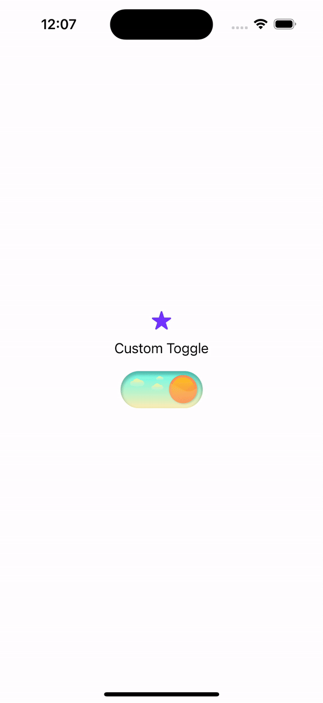

# CustomSwitch

## Description

A snippet showcasing a custom SwiftUI toggle switch that adapts the app's appearance between dark and light modes.

## Video Demonstration

## Attribution

Design elements by [The Visual Team], "[Toggle Buttons]", available on Figma Community at [Toggle Buttons](https://www.figma.com/community/file/977510812493321569), licensed under CC BY 4.0.